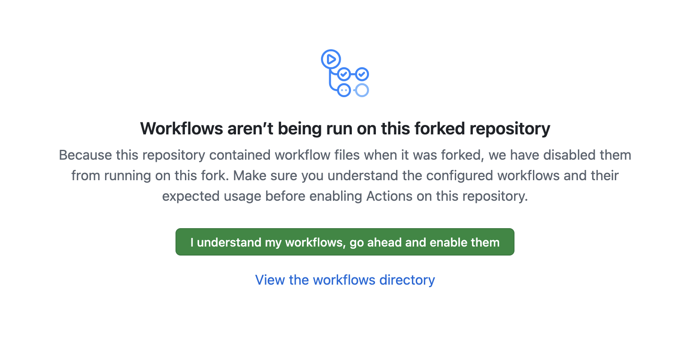
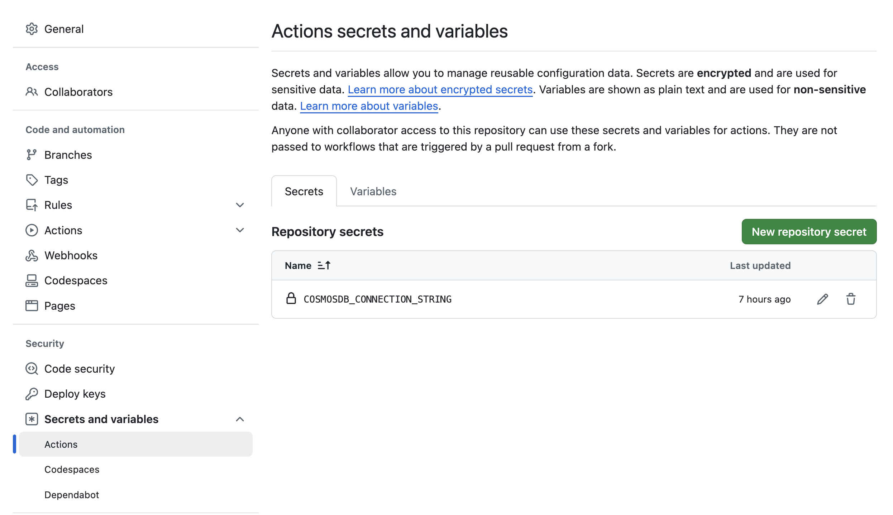
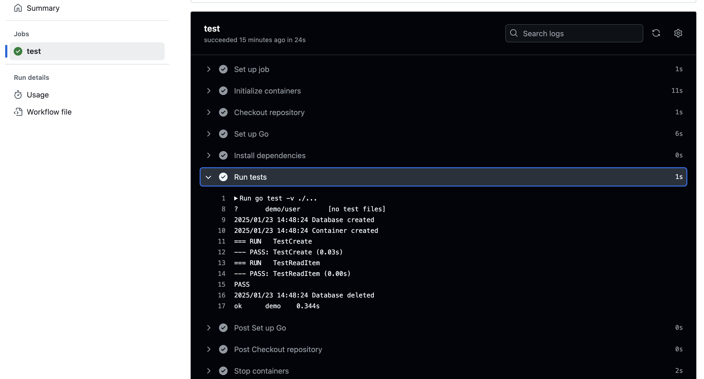

# Using Azure Cosmos DB Linux emulator (preview) in GitHub Actions

Example of how to use the Azure Cosmos DB Linux emulator in GitHub Actions to run integration tests.

## Instructions

Fork [this repository](https://github.com/abhirockzz/cosmosdb-emulator-github-actions) and click the **Fork** button at the top-right corner of the repository page to create a copy of the repository under your own GitHub account.

Go to your GitHub account, open the repository and make sure to enable workflows in the repository settings.



Add the Cosmos DB emulator connection string as [secret](https://docs.github.com/en/actions/security-for-github-actions/security-guides/using-secrets-in-github-actions#creating-secrets-for-a-repository) to the repository. Use the following value: `AccountEndpoint=http://localhost:8081/;AccountKey=C2y6yDjf5/R+ob0N8A7Cgv30VRDJIWEHLM+4QDU5DE2nQ9nDuVTqobD4b8mGGyPMbIZnqyMsEcaGQy67XIw/Jw==`



Add database and container names as [variables](https://docs.github.com/en/actions/writing-workflows/choosing-what-your-workflow-does/store-information-in-variables#creating-configuration-variables-for-a-repository):


Clone your forked repository to your local machine:

```bash
git clone https://github.com/your-username/cosmosdb-emulator-github-actions.git
cd cosmosdb-emulator-github-actions
```

To trigger the workflow, make a small change to the code, add and commit your changes. Push your changes to your forked repository on GitHub:

```bash
git add .
git commit -m "Your commit message"
git push origin main
```

After pushing your changes, GitHub Actions will automatically run the workflow. Go to the **Actions** tab in your repository to see the status and results of the workflows. Review any logs or output to ensure the workflows are running correctly.



## Note on MacOS runner

This works if you are running CI/CD on a linux based runner (like ubuntu) that supports `docker` (and has it pre-installed).

If you need to use MacOS runner, note that GitHub MacOS runner does not have `docker` installed by default due to [licensing issues](https://github.com/actions/runner-images/issues/2150).

There are other workarounds like using [this action](https://github.com/marketplace/actions/setup-docker-on-macos), but it does not work for ARM64 (M1 and above) processors. This defeats the purpose of the testing the emulator, since this action only works on `macos-13` which is AMD (not ARM64)
